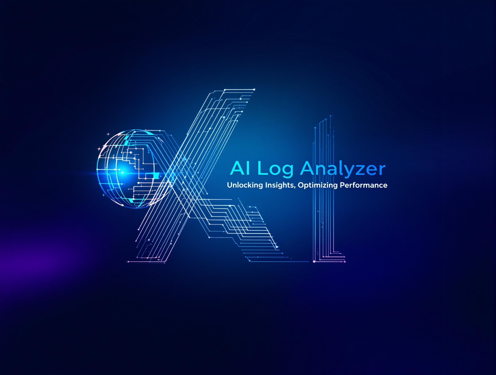

# 📊 LogIAnalyzer - Surveillance et Analyse des Logs avec IA

<p align="center">
  
</p>

<p align="center">
  <a href="https://github.com/renaudgweb/LogIAnalyzer/blob/main/LICENSE"></a>
  <a href="https://www.python.org/downloads/"></a>
</p>

🚀 **LogIAnalyzer** est un script Python qui surveille en continu les logs de votre serveur web et envoie des alertes par email en cas d'anomalies détectées.

## ✅ Prérequis
- 🐍 Python 3
- 🔑 Un compte OpenAI ou Mistral AI avec une clé API
- 📧 Un serveur SMTP pour l'envoi d'e-mails
- 📂 Un accès aux fichiers logs du serveur web

## 📦 Installation

### 1️⃣ Cloner le dépôt
```bash
git clone https://github.com/renaudgweb/LogIAnalyzer.git
cd LogIAnalyzer
```

### 2️⃣ Installer les dépendances
```bash
pip install -r requirements.txt
```

### 3️⃣ Configurer les paramètres
Créez un fichier **`config.ini`** dans le répertoire du script :
```ini
[Settings]
log_files = /var/log/apache2/error.log, /var/log/apache2/access.log, /var/log/auth.log
email_sender = ton_email@mail.com
email_receiver = destinataire@mail.com
smtp_server = smtp.mail.com
smtp_port = 587
log_check_interval = 300
ai_temperature = 0.5
ai_max_tokens = 4096
daily_report_file = /var/log/log_analyzer_daily_report.txt
```

Définissez les **variables d'environnement** pour les données sensibles, ajoutez ces variables dans `.env` :
```bash
AI_API_KEY="ta_cle_api"
SMTP_PASSWORD="ton_mot_de_passe"
```
Rechargez les variables :
```bash
sudo chmod 600 .env
```

## ⚙️ Utilisation avec systemd

### 1️⃣ Créer un service systemd
Créez le fichier **`/etc/systemd/system/logianalyzer.service`** :
```ini
[Unit]
Description=Surveillance des logs avec IA
After=network.target

[Service]
User=root  # Remplacez par l'utilisateur ayant accès aux logs
ExecStart=/usr/bin/python3 /chemin/vers/logianalyzer.py
Restart=always

[Install]
WantedBy=multi-user.target
```

### 2️⃣ Activer et démarrer le service
```bash
sudo systemctl daemon-reload
sudo systemctl enable logianalyzer
sudo systemctl start logianalyzer
```

### 3️⃣ Vérifier le statut du service
```bash
sudo systemctl status logianalyzer
```

## 📜 Logs et Rapports
- **Fichier de rapport quotidien** : `/var/tmp/log_analyzer_daily_report.txt`
- Pour consulter les logs du service :
  ```bash
  journalctl -u logianalyzer -f
  ```

- 🔄 Redémarrer le service après modification :
```bash
sudo systemctl restart logianalyzer
```

## ❌ Désinstallation
Désactiver et supprimer le service :
```bash
sudo systemctl stop logianalyzer
sudo systemctl disable logianalyzer
sudo rm /etc/systemd/system/logianalyzer.service
sudo systemctl daemon-reload
```

## ✅ Améliorations possibles
✨ Ajouter la prise en charge de plusieurs modèles d'IA  
✨ Affiner les alertes avec des seuils de gravité configurables  
✨ Ajouter une interface web pour la visualisation des logs  

---
**🚀 Profitez d'une surveillance proactive et optimisée des logs avec l'IA !**

## 📜 Licence

LogIAnalyzer is released under the [MIT License](LICENSE).

```
MIT License

Copyright (c) 2025 RenaudG

Permission is hereby granted, free of charge, to any person obtaining a copy
of this software and associated documentation files (the "Software"), to deal
in the Software without restriction, including without limitation the rights
to use, copy, modify, merge, publish, distribute, sublicense, and/or sell
copies of the Software, and to permit persons to whom the Software is
furnished to do so, subject to the following conditions:

The above copyright notice and this permission notice shall be included in all
copies or substantial portions of the Software.

THE SOFTWARE IS PROVIDED "AS IS", WITHOUT WARRANTY OF ANY KIND, EXPRESS OR
IMPLIED, INCLUDING BUT NOT LIMITED TO THE WARRANTIES OF MERCHANTABILITY,
FITNESS FOR A PARTICULAR PURPOSE AND NONINFRINGEMENT. IN NO EVENT SHALL THE
AUTHORS OR COPYRIGHT HOLDERS BE LIABLE FOR ANY CLAIM, DAMAGES OR OTHER
LIABILITY, WHETHER IN AN ACTION OF CONTRACT, TORT OR OTHERWISE, ARISING FROM,
OUT OF OR IN CONNECTION WITH THE SOFTWARE OR THE USE OR OTHER DEALINGS IN THE
SOFTWARE.
```
